# c#算法

[toc]

## 算法目录

分治法

推排序

二叉树

动态规划

贪心算法

图

## 算法的作用

## 学习算法的作用

理解编程

让编码过程更通畅

提高解决程序问题的能力

## 分治算法

### 最大子数组问题

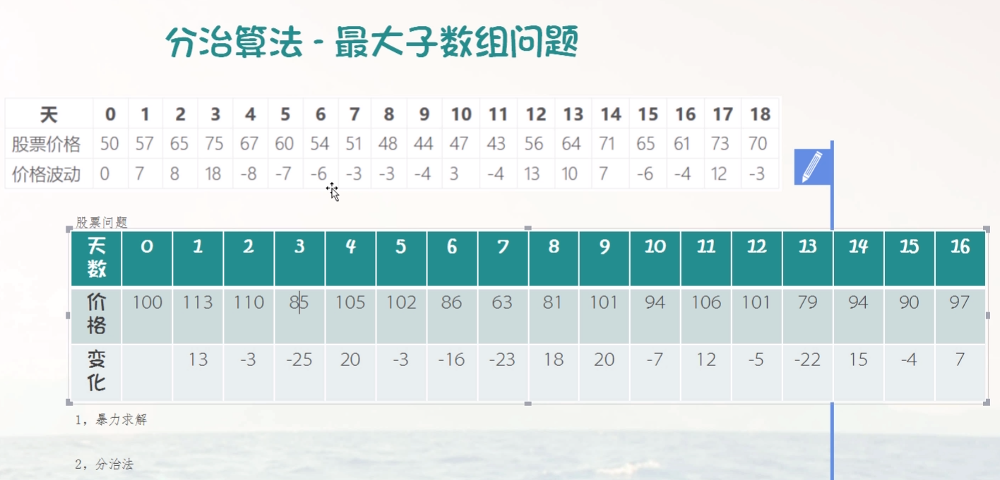

#### 暴力求解

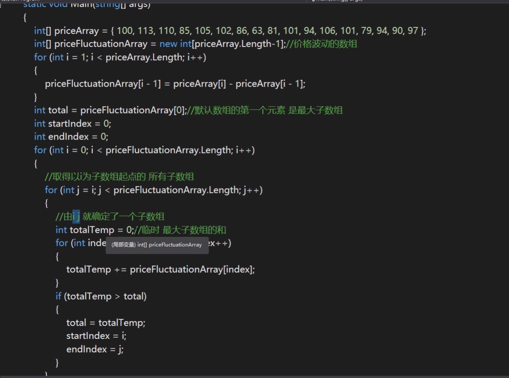

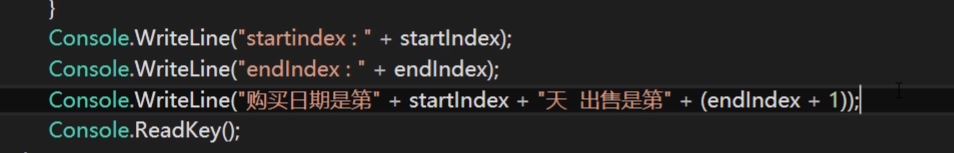

#### 分治法

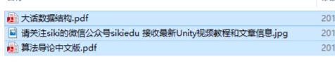

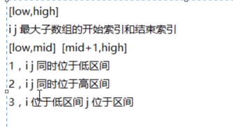

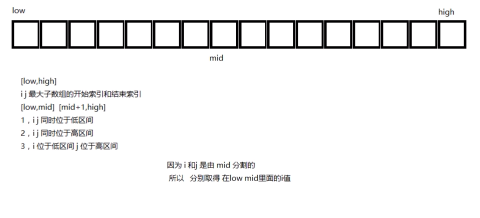

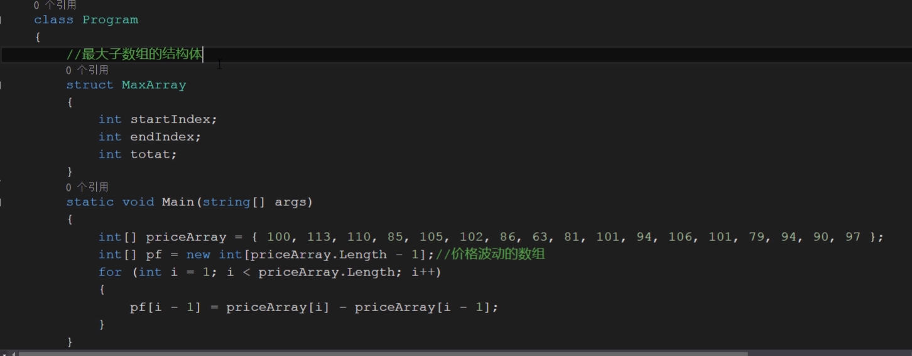

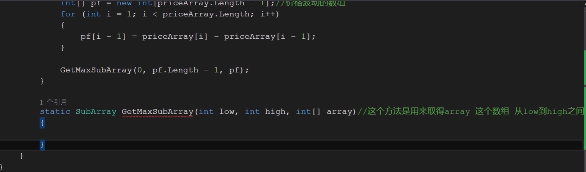

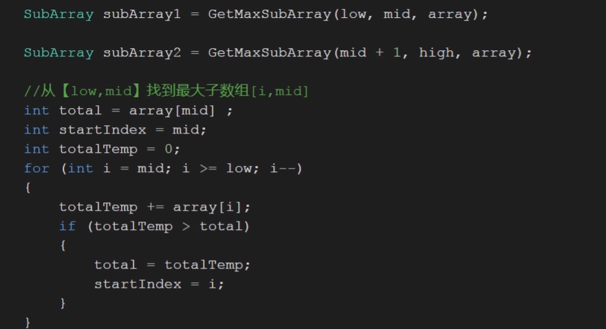

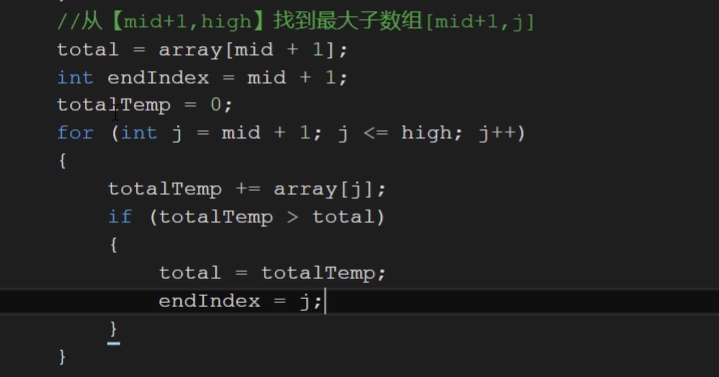

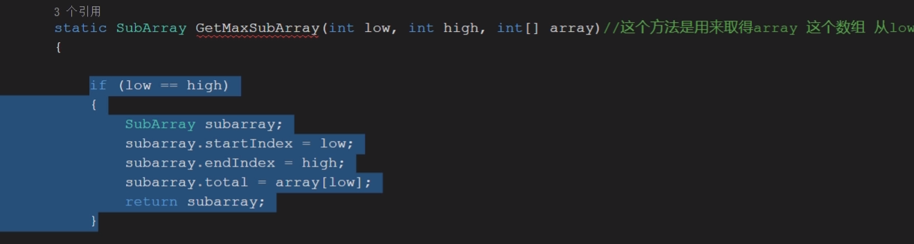

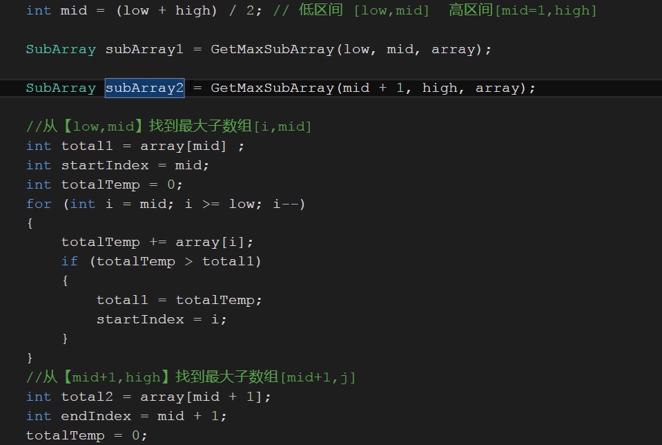

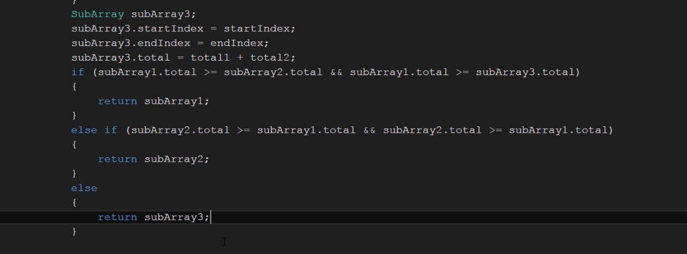

## 树-数据结构的一种

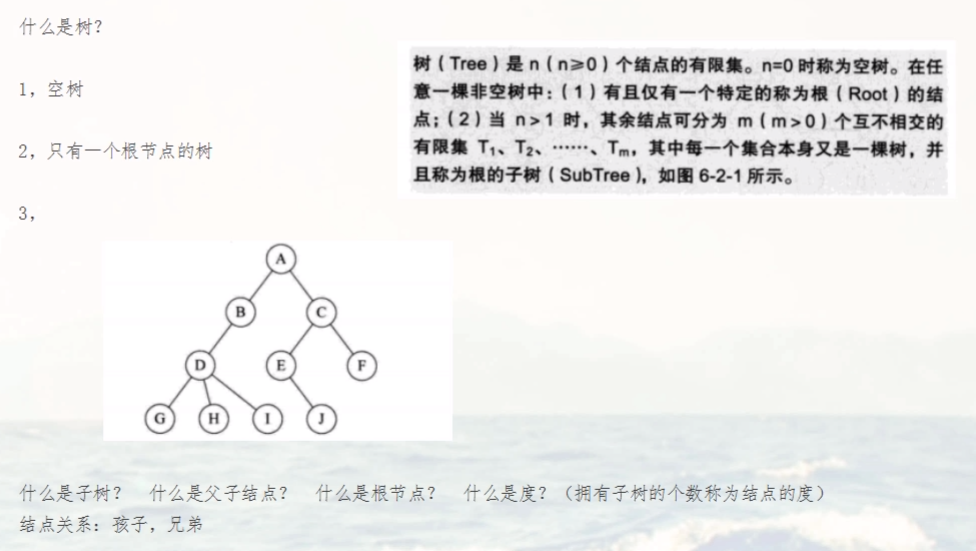

### 树的层次\深度\有序和无序树

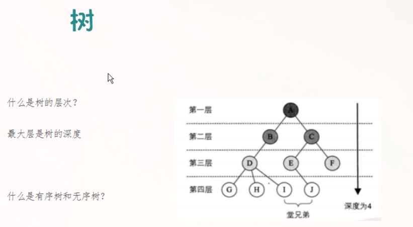

### 树的错误案例

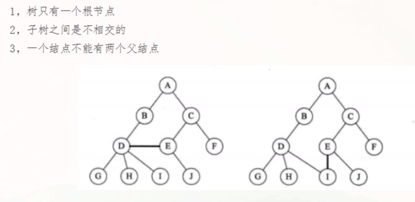

### 树的存储结构

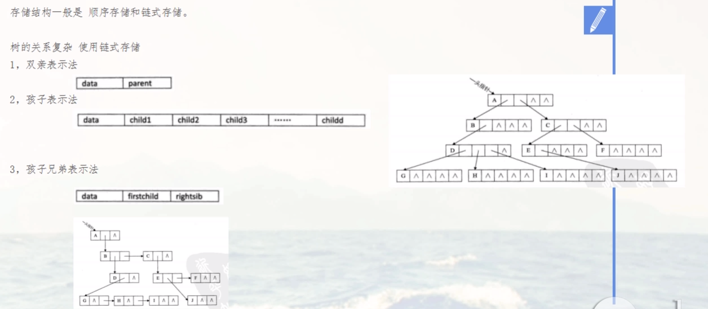

1. 顺序存储: 数组,数据间的关系难以记录

2. 链式存储: 定义对象,通过引用互相访问,默认使用链式

#### 链式存储的方式

1. 双亲表示法

   可以很方便的访问到父亲节点,但无法方便的访问到兄弟和子节点

   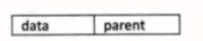

2. 孩子表示法

   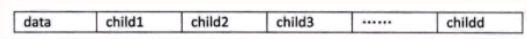

   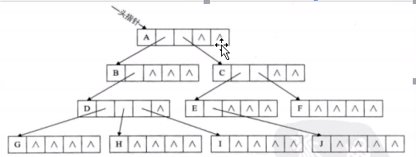

   可以很方便的访问到孩子节点,不方便访问到父亲节点和兄弟节点

   浪费存储空间且扩展性不大

3. 孩子兄弟表示法

   你的数据  你的第一个孩子  你自己右边的兄弟

   很难得到父亲节点

   

   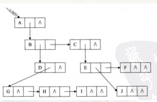

## 二叉树(堆排序)

### 什么是二叉树

每个节点最多只能有两个子节点,且两个子节点间有左右顺序的

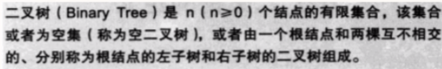

* 空二叉树:一个节点都没有
* 只有根节点
* 大于一个节点

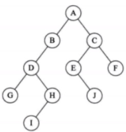

### 左右子树

B下面的一串是左子树,C是右子树

### 特殊的二叉树

1. 斜树:只有一边
   1. 左斜树:往左斜
   2. 右斜树:往右斜

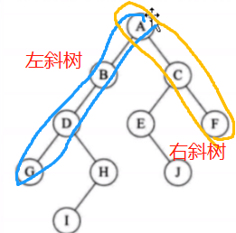

2. 满二叉树

   树的除了最后一层外的其他任意一层都有两个子节点

   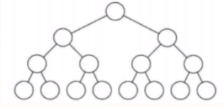

3. 完全二叉树:对一颗具有N个节点的二叉树按层序编号,如果编号为i(1<i<n)的节点与周围同样深度的满二叉树中编号为i的节点在二叉树中位置完全相同,则这颗二叉树成为完全二叉树.

   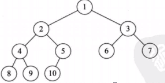

满二叉树最后一层,从右向左,开始依次连续的减少,,不能隔几个少,就形成了完全二叉树

满二叉树==完全二叉树

### 非完全二叉树

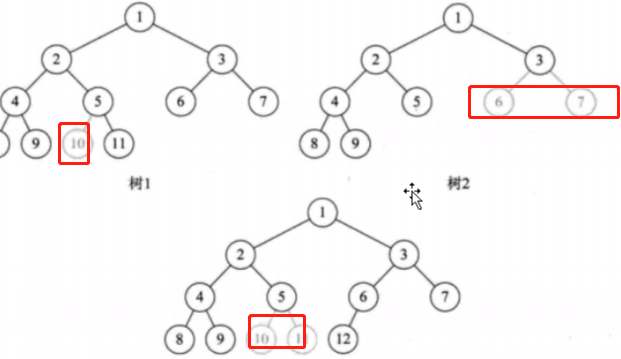

### 二叉树的性质

1. 在二叉树的第i层上最多右2^i-1^个节点(i>=1)

   ​	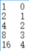

2. 深度为k的二叉树之多右2^k^-1个节点

   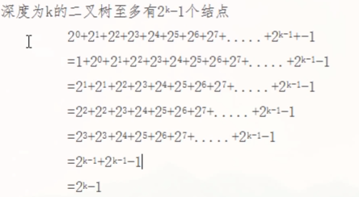

3. 对于一个完全二叉树,假设有n个节点,堆节点从1开始编号,对任一节点满足下面条件

   1. 他的双亲是节点i/2(除了i=1)
   2. 左孩子是2i,右孩子是2i+1
   3. 如果2i>n说明无左孩子,2i+1>n说明无右孩子

   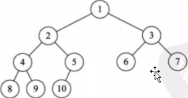

### 二叉树的存储结构

#### 顺序存储

一般的树来说是一对多的关系,使用顺序结构存储起来较困难,但是`二叉树`是一种特殊的树,`每个节点最多有二个子节点`,并且`子节点有左右之分`,并且`兄弟/父亲/孩子可以很方便的通过编号获得`,所以我们使用顺序结构进行二叉树的存储

==顺序存储一般用于完全二叉树的存储==

##### 二叉树存储(满二叉树)

按照满二叉树的状态进行编号,根据编号获取数组的索引

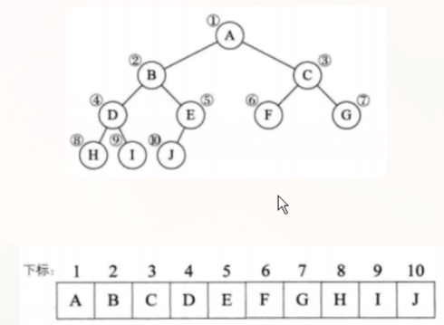

##### 二叉树存储(部分二叉树)

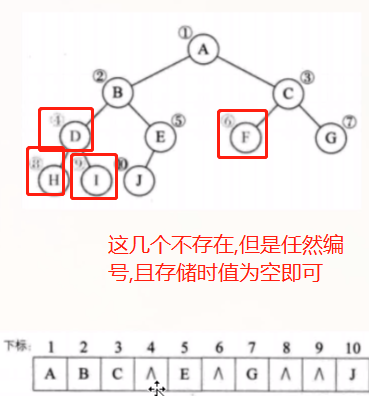

##### 二叉树存储(左右斜二叉树)

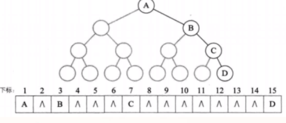

#### 顺序存储的代码实现

二叉树类

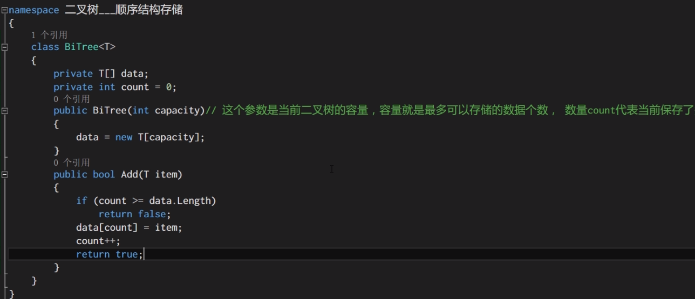

存储类

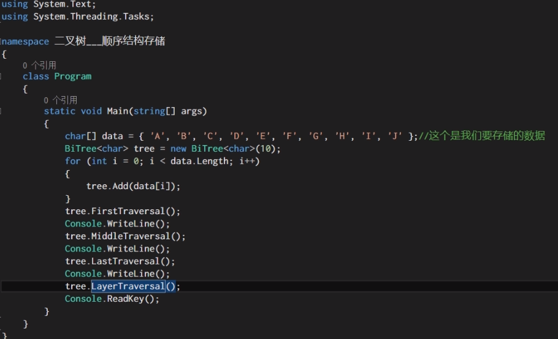

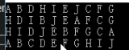

#### 链式存储:二叉链表存储

二叉树每个节点最多有两个孩子,所以设计一个数据和两个指针域,这样的链表称为二叉链表

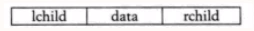

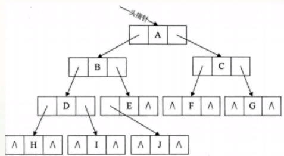

### 二叉树的遍历

二叉树的遍历是从根节点开始,按照某种次序依次访问二叉树中的所有节点,使得每个节点仅且被访问一次

1. 前序遍历:先输出当前节点的数据,在一次遍历输出左节点和右节点

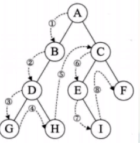

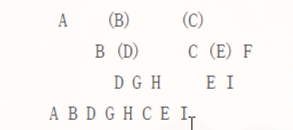

==前序遍历:非完全二叉树,存储-1表示数据为空==

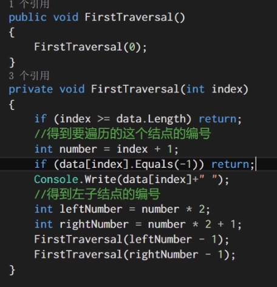

2. 中序遍历: 先遍历输出左节点,在输出当前节点的数据,在遍历输出右节点

   

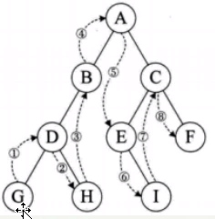

中序遍历

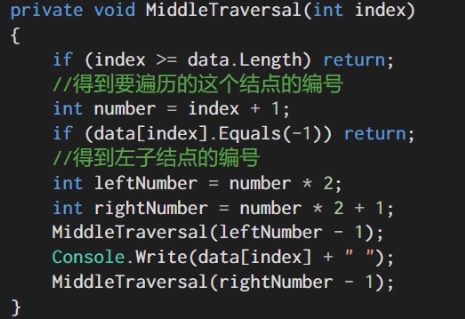

3. 后序遍历: 先便利输出左节点,在遍历输出右节点,最后输出当前节点的数据

   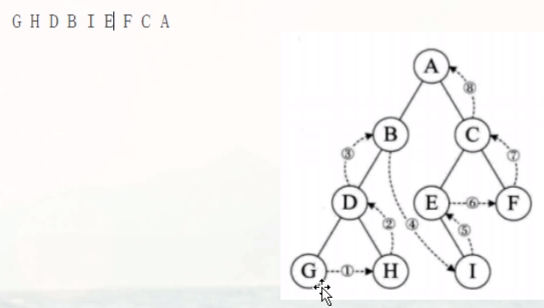

   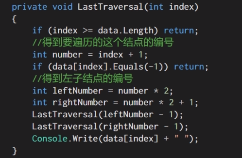

4. 层序遍历:从书店第一层开始,从上到下逐层遍历,在同一层中,从左到右对节点逐个访问输出

   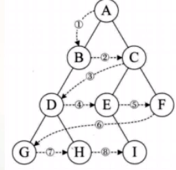

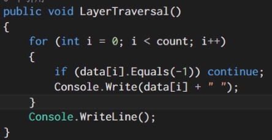

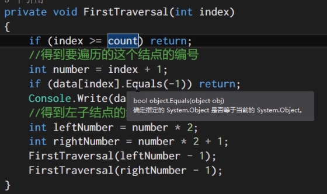

### 二叉排序树

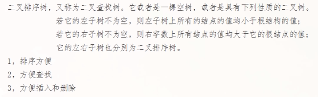

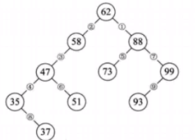

#### 二叉排序树的删除操作

#### 二叉排序树的存储

因为二叉排序树的存储,和自身值的大小有关系,不可以使用顺序结构,使用链式结构存储

#### 二叉排序树的代码实现

树类定义BSTree	节点类定义BSNode

#### 二叉排序树链式存储

##### 中序排序

##### 查找

###### ==查找方法的优化==

第一种

第二种

