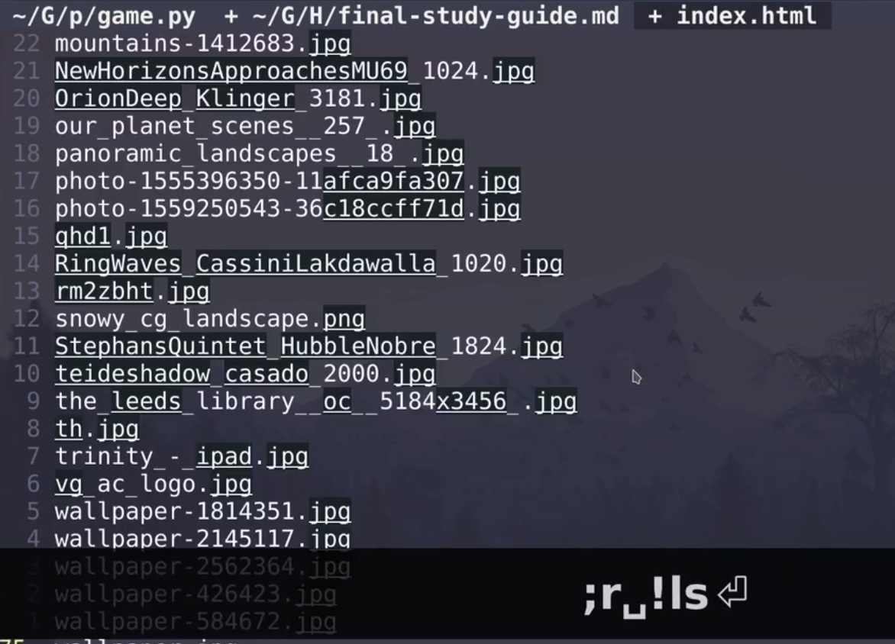
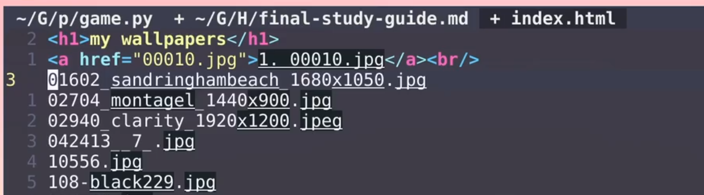
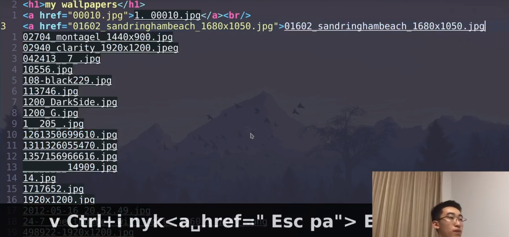
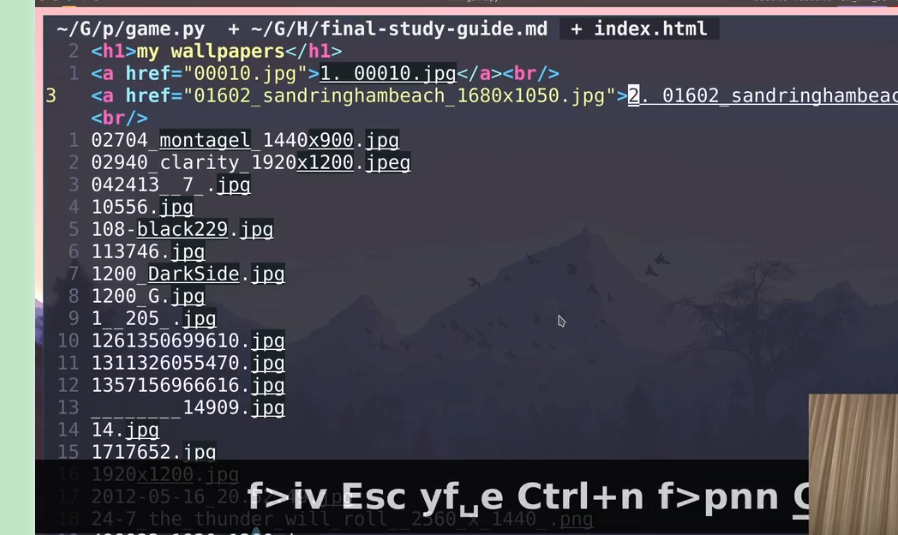

# VIM 上古神器

[toc]

## 将命令执行结果打印到文件中

# vim数字输入（加1，减1）大小写切换

数字加减：普通模式下:ctrl+a(+) ctrl+x(-)

- ~：切换光标所在位置的字符的大小写形式，大写转换为小写，小写转换为大写
- 3~：将光标位置开始的3个字母改变其大小写

 

  https://blog.csdn.net/lanchunhui/article/details/51542211

  注意以下均是在，normal mode（普通模式）下操作的。

\1. 单个字符的处理

  ~：切换光标所在位置的字符的大小写形式，大写转换为小写，小写转换为大写
  3~：将光标位置开始的3个字母改变其大小写

\2. 文本整体的处理

gu：切换为小写，gU：切换为大写，剩下的就是对这两个命令的限定（限定行字母和单词）等等。
2.1 整篇文章

无须进入命令行模式，键入：

  ggguG：整篇文章转换为小写，gg：文件头，G：文件尾，gu：切换为小写
  gggUG：整篇文章切换为大写，gg：文件头，G：文件尾，gU：切换为大写

2.2 只转化某个单词

  guw、gue
  gUw、gUe
  gu5w：转换 5 个单词
  gU5w

2.3 转换行

  gU0 ：从光标所在位置到行首，都变为大写
  gU$ ：从光标所在位置到行尾，都变为大写
  gUG ：从光标所在位置到文章最后一个字符，都变为大写
  gU1G ：从光标所在位置到文章第一个字符，都变为大写  
\---------------------  

